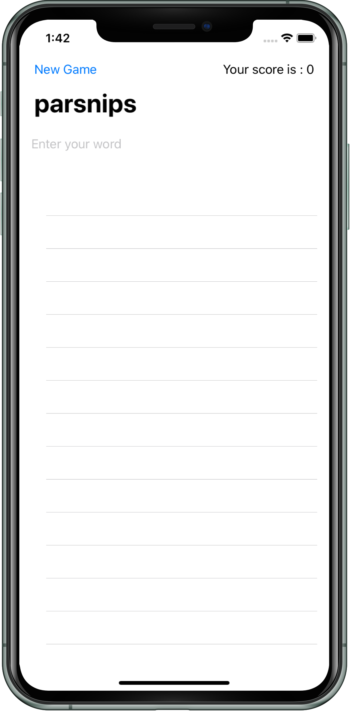

# WordScramble

WordScramble is an app part of the #100DaysOfSwift challenges

---

1. [Warning](#warning)
2. [System Requirements](#system-requirements)
3. [Changelog](https://github.com/yo-op/sketchcachecleaner/blob/master/CHANGELOG.md)
4. [Tips](#tips)
5. [Authors](#authors)
6. [License](#license)

---

## Warning

The app idea inspired by : [100 Days of SwiftUI Day 29](https://www.hackingwithswift.com/100/swiftui/29)

This app will include over 10,000 eight-letter words that will be randomly selected for the player to work with.  You will get points for making up words.

---

### System Requirements

- macOS 10.15+
- Xcode 11.0+
- Swift 5.1+

---

### Author

Development: [Laurent Brusa](https://twitter.com/wrmultitudes)

---

### Tips

- Use this app wisely.

---

### License

WordScramble is distributed under the [MIT license]().
